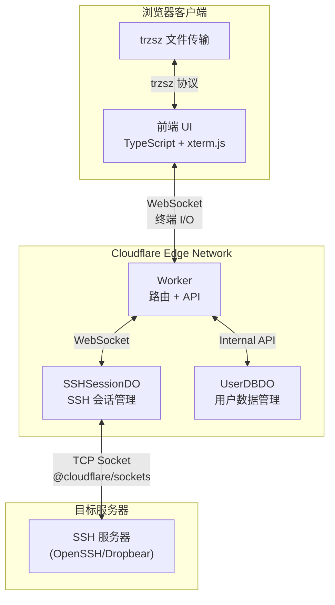

<div align="center">
  <h1>CloudSSH</h1>
  <p>一个基于 Cloudflare Workers 的 Serverless Web SSH 终端：通过浏览器直接连接和管理你的服务器。</p>
  <p><b>极致轻量 · 开箱即用 · 赛博朋克 UI</b></p>
  <p>
    <a href="https://github.com/newbietan/CloudSSH/stargazers"></a>
    <a href="LICENSE"></a>
    
    
    
  </p>
  <p>
    <a href="#highlights">核心优势</a> ·
    <a href="#features">功能特性</a> ·
    <a href="#quick-start">部署指南</a> ·
    <a href="#architecture">架构设计</a> ·
    <a href="#license">开源协议</a>
  </p>
  <p>
    <a href="README.md">简体中文</a> |
    <a href="README_en.md">English</a>
  </p>
</div>

> [!TIP]
> **CloudSSH** 利用 Cloudflare Workers 的 TCP Sockets 支持，在边缘节点实现 SSH 协议的解析与转发，提供低延迟的 Web 终端体验。

## 效果演示

> 想象一下，随时随地打开浏览器，就能以极具科技感的赛博朋克 UI 连接你的服务器，无需安装任何 SSH 客户端。


## 目录

- [核心优势](#highlights)
- [核心特性](#features)
- [架构说明](#architecture)
- [快速部署](#quick-start)
- [开发说明](#development)
- [开源协议](#license)

<a id="highlights"></a>
## 核心优势

### 极致 Serverless

- **零服务器成本**：纯前端部署 + Cloudflare Workers，无需自建后端服务器。
- **边缘加速**：得益于 Cloudflare 的全球边缘网络，随时随地享受低延迟的 SSH 连接。

### 开箱即用

- **一键部署**：通过 Wrangler 工具，一句命令即可完成项目构建与部署。
- **现代化前端技术栈**：TypeScript + Vite + Tailwind CSS，配合 xterm.js 提供丝滑的终端体验。

### 安全可靠

- **端到端加密**：完整的 SSH-2.0 协议实现，支持 Curve25519-SHA256（优先）和 ECDH-NISTP256 密钥交换，AES-256-GCM（优先）/ AES-128-GCM / AES-256-CTR 数据加密，以及 HMAC-SHA2-256/512 完整性校验。
- **多算法主机密钥验证**：支持 Ed25519、ECDSA P-256、RSA 签名验证，首次连接展示 SHA-256 指纹（TOFU 模式）。
- **安全加固体系**：内置针对 IPv6 与保留地址的 SSRF 防护、API 请求频率限制（防爆破），并在本地使用 AES-256-GCM 算法加密存储您的服务器凭证。
- **人机验证**：支持 Cloudflare Turnstile 验证，防止恶意机器人滥用。
- **隔离的会话状态**：借助 Cloudflare Durable Objects 和 Hibernation API，每个终端会话都在沙盒内安全、持久地运行。
- **凭据零暴露**：One-Time-Token 机制确保密码/私钥不经过前端，完全在 Worker 内部安全流转。

<a id="features"></a>
## 核心特性

- **纯 TypeScript SSH-2.0 实现**：完全自研的 SSH 协议栈，不依赖任何第三方 SSH 库，基于 Web Crypto API 实现全部加密操作。
- **多算法密钥交换**：支持 Curve25519-SHA256（优先）和 ECDH-NISTP256 两种 KEX 算法，适配各类 SSH 服务器（包括 Dropbear）。
- **IPv4/IPv6 双栈**：完整支持 IPv4 和 IPv6 地址连接，包括 IPv6 方括号格式自动处理。
- **多种认证方式**：支持标准 SSH 密码认证以及基于 Ed25519 的纯文本私钥认证。
- **防范中间人攻击 (TOFU)**：首次连接自动提取服务器 Host Key（SHA-256 指纹）并显示，支持 Ed25519/ECDSA/RSA 签名验证。
- **全功能极客终端**：基于 `@xterm/xterm` 与 `@xterm/addon-webgl` 硬件加速渲染引擎，保证海量日志输出顺滑不卡顿。
- **个性化 UI**：提供 Cyberpunk、Glacier、Gruvbox 等经典终端主题一键切换，支持移动端适配。
- **原生文件传输**：集成 [trzsz.js](https://github.com/trzsz/trzsz.js)，支持 `trz`（上传）/ `tsz`（下载）命令进行文件传输，兼容 tmux 会话。还支持拖拽文件到终端窗口直接上传、目录传输及断点续传等高级功能。（需远程服务器安装 [trzsz](https://trzsz.github.io/)）
- **GitHub OAuth 集成**：支持 GitHub 登录，用户可保存和管理常用 SSH 服务器，实现一键连接。

<a id="architecture"></a>
## 架构说明

### 系统架构



### 核心组件

| 组件 | 文件 | 职责 |
|------|------|------|
| **Worker 入口** | `src/worker/index.ts` | HTTP 路由、API 处理、WebSocket 升级 |
| **SSHSessionDO** | `src/worker/durable-object.ts` | SSH 会话生命周期管理、SSRF 防护 |
| **UserDBDO** | `src/worker/user-db.ts` | 用户数据、服务器配置、速率限制（SQLite） |
| **SSHSession** | `src/worker/ssh-session.ts` | SSH 协议状态机（连接→版本→密钥交换→认证→交互） |
| **SSH 协议栈** | `src/ssh/*.ts` | 纯 TypeScript SSH-2.0 实现（传输层、加密、认证、通道） |
| **前端终端** | `frontend/src/terminal.ts` | xterm.js 封装、trzsz 集成、WebSocket 管理 |

### SSH 协议实现

本项目实现了完整的 SSH-2.0 协议栈：

| 层级 | 实现 | 支持算法 |
|------|------|----------|
| **密钥交换** | `kex-curve25519.ts` / `kex-ecdh.ts` | curve25519-sha256, ecdh-sha2-nistp256 |
| **数据加密** | `crypto.ts` | aes256-gcm, aes128-gcm, aes256-ctr, aes192-ctr, aes128-ctr |
| **完整性校验** | `crypto.ts` | hmac-sha2-256, hmac-sha2-512, hmac-sha1 |
| **主机密钥** | `ssh-session.ts` | Ed25519, ECDSA P-256, RSA |
| **用户认证** | `auth.ts` | 密码认证, Ed25519 公钥认证 |
| **通道管理** | `channel.ts` | session channel, PTY, shell, window-change |

### 数据流

1. 用户在前端输入主机 IP、账号和密码（或通过 GitHub OAuth 选择已保存的服务器）。
2. 前端与后端的 Durable Object 建立 WebSocket 连接。
3. SSHSessionDO 接收凭据，使用 `@cloudflare/sockets` 与目标 SSH 服务器建立 TCP 连接。
4. SSHSession 执行完整的 SSH 协议协商（版本交换→密钥交换→认证→打开通道→PTY→Shell）。
5. 加密的终端数据通过 WebSocket 在前端和 SSH 服务器之间双向转发。

<a id="quick-start"></a>
## 快速部署

### 前置要求

- 一个 Cloudflare 账号。
- Node.js 环境 (v18+)。
- 启用 Cloudflare Workers 免费计划（TCP Sockets 和 Durable Objects 功能需要）。

### 部署步骤

#### 方式一：通过 GitHub 绑定自动部署（推荐）

1. **Fork 本仓库** 到你的 GitHub 账号。
2. **一键部署**：登录 Cloudflare，进入 Workers & Pages 绑定你的 GitHub 账号，选择刚才 Fork 的仓库进行应用创建。
3. **填写构建命令**：在部署设置中，请务必将"构建命令"（Build command）填写为 `pnpm run build:frontend`，然后点击保存并部署（无需填写构建输出目录）。
4. **访问应用**：部署成功后，可通过默认域名 `https://cloudssh.<你的子域>.workers.dev` 访问。
5. **绑定自定义域名**（可选）：在 Cloudflare Dashboard 的 Workers 设置中，进入 "Triggers" → "Custom Domains" 添加你的域名。

#### 方式二：本地命令行部署

1. **克隆仓库**
   ```bash
   git clone https://github.com/newbietan/CloudSSH.git
   cd CloudSSH
   ```

2. **安装依赖**
   ```bash
   npm install -g pnpm
   pnpm install
   ```

3. **登录 Cloudflare**
   ```bash
   npx wrangler login
   ```

4. **一键部署**
   ```bash
   pnpm run deploy
   ```

部署完成后，Wrangler 会输出你的 Worker URL。打开浏览器访问该 URL，即可开始使用你的 Web SSH 终端。

5. **绑定自定义域名**（可选）：在 Cloudflare Dashboard 的 Workers 设置中，进入 "Triggers" → "Custom Domains" 添加你的域名。

#### 可选：配置 Turnstile 人机验证

为防止恶意机器人滥用，建议启用 Cloudflare Turnstile 验证：

1. **创建 Turnstile Widget**：登录 [Cloudflare Dashboard](https://dash.cloudflare.com/)，进入 Turnstile 页面创建一个新的 Widget。
2. **获取密钥**：创建后会获得一个 **Site Key**（公开）和一个 **Secret Key**（保密）。
3. **配置环境变量**：在 Cloudflare Dashboard 的 Workers 设置中，进入 "Settings" → "Variables and Secrets"，添加以下环境变量：
   - `TURNSTILE_SECRET` = 你的 Secret Key（类型选择 Secret）
   - `TURNSTILE_SITEKEY` = 你的 Site Key（类型选择 Text）
4. **重新部署**：运行部署命令使配置生效。

> **说明**：Turnstile 验证为会话级别，用户通过验证后当前会话内所有功能可用，关闭浏览器后需重新验证。

#### 可选：配置 GitHub OAuth 登录与服务器管理

启用 GitHub 登录后，用户可以通过 GitHub 账号登录，并在个人空间中保存和管理常用的 SSH 服务器，实现一键连接。不配置时，此功能自动隐藏，不影响匿名 SSH 连接的正常使用。

1. **创建 GitHub OAuth App**：
   - 登录 GitHub → Settings → Developer settings → OAuth Apps → [New OAuth App](https://github.com/settings/applications/new)
   - **Application name**：`CloudSSH`（自定义）
   - **Homepage URL**：`https://your-domain.com`（你的部署域名）
   - **Authorization callback URL**：`https://your-domain.com/api/auth/callback`
   - 创建后获得 **Client ID**，点击 **Generate a new client secret** 生成 **Client Secret**（仅显示一次，请立即保存）

2. **配置环境变量**：在 Cloudflare Dashboard 的 Workers 设置中，进入 "Settings" → "Variables and Secrets"，添加以下环境变量：
   - `GITHUB_CLIENT_ID` = 你的 Client ID（类型选择 Text）
   - `BASE_URL` = `https://your-domain.com`（你的部署域名，类型选择 Text）
   - `GITHUB_CLIENT_SECRET` = 你的 Client Secret（类型选择 Secret）

3. **重新部署**：如果你是刚刚修改了环境变量，且是首次启用该功能，请务必删除旧版并全新部署以初始化数据库。

> **说明**：服务器凭据（密码/私钥）在数据库中使用 AES-256-GCM 加密存储，本地加密密钥将自动生成并安全地存储在数据库中（也可在环境变量中手动设置 `SESSION_SECRET` 来指定）。连接时凭据不经过前端，通过 one-time-token 机制安全传递。

> **注意**：首次启用此功能需要从零部署（删除旧 Worker 后重新部署），因为需要初始化新的 Durable Object。可通过 `npx wrangler delete cloudssh` 删除旧 Worker，然后运行 `pnpm run deploy` 重新部署。

<a id="development"></a>
## 开发说明

### 项目结构

本项目采用 pnpm monorepo 工作区结构：

```
CloudSSH/
├── src/                    # 后端源码 (Cloudflare Worker)
│   ├── ssh/                # SSH 协议纯实现层
│   └── worker/             # Worker 入口和 Durable Objects
├── frontend/               # 前端源码 (独立 workspace)
│   ├── src/                # TypeScript + xterm.js + trzsz
│   └── package.json        # 前端依赖
├── scripts/                # 构建脚本
├── pnpm-workspace.yaml     # pnpm 工作区配置
└── wrangler.toml           # Cloudflare 部署配置
```

### 本地开发

1. **安装依赖**
   ```bash
   pnpm install
   ```

2. **启动开发服务器**
   ```bash
   pnpm run dev
   ```
   此命令将构建前端并启动 Wrangler 本地开发环境。

3. **仅构建前端**
   ```bash
   pnpm run build:frontend
   ```

### 技术栈

| 层级 | 技术 | 说明 |
|------|------|------|
| **前端** | TypeScript + Vite + xterm.js | Web 终端模拟器，WebGL 硬件加速 |
| **UI 框架** | Tailwind CSS (CDN) | 赛博朋克风格暗色主题 |
| **文件传输** | trzsz.js | 支持 trz/tsz 命令、拖拽上传、断点续传 |
| **后端** | Cloudflare Workers | Serverless 边缘计算 |
| **会话管理** | Durable Objects | SSH 会话隔离、Hibernation API |
| **数据存储** | Durable Objects SQLite | 用户数据、服务器配置 |
| **包管理** | pnpm (workspace) | Monorepo 依赖管理 |

<a id="license"></a>
## 开源协议

本项目基于 [Apache License 2.0](LICENSE) 协议开源。

**特别声明**：本项目允许商业使用及二次修改，但必须明确注明原作者。

欢迎提交 Issue 和 Pull Request 共建社区。如果这个项目对你有帮助，恳求大家给本项目点个 ⭐ Star 支持一下，非常感谢！

## Star History

<a href="https://www.star-history.com/?type=date&repos=newbietan%2FCloudSSH">
 <picture>
   <source media="(prefers-color-scheme: dark)" srcset="https://api.star-history.com/chart?repos=newbietan/CloudSSH&type=date&theme=dark&legend=top-left" />
   <source media="(prefers-color-scheme: light)" srcset="https://api.star-history.com/chart?repos=newbietan/CloudSSH&type=date&legend=top-left" />
   
 </picture>
</a>
